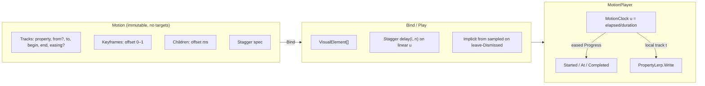

# Animate.Motion — reusable in-page view animation for Reactor.Animate

| Field | Value |
|---|---|
| **Author** | TBD |
| **Date** | 2026-09-26 |
| **Status** | Draft (owner questions resolved) |
| **Branch** | `the_flutter_way` |
| **Workspace** | `/Users/otuyishime/Developer/GitHub/ReactorAnimate` |
| **Companion experiments** | `/Users/otuyishime/Developer/GitHub/MauiAnimate/src/MauiAnimate` |

---

## Overview

Reactor.Animate today owns **cross-page** shared-element flights (`Animate.Page`) and tells authors to use MauiReactor `WithAnimation` for everything that happens on a live page. That split is too sharp. `WithAnimation` is declarative, re-render-driven, and has no pause, reverse, seek, keyframes, timeline, stagger, or reusable recipe. The owner’s lab in `MauiAnimate` (`GenericAnimate`, `ReAnimate`, `Tickers`) tried to fill that gap and got the control surface right — then mixed definition with playback, pre-baked frame tables, and Guid-string sequencing.

This design adds **`Animate.Motion`**, a sibling nested type of `Animate.Page`. The recipe type is also **`Motion`** (in `Reactor.Animate.Animation`). Inside the nested class, that recipe is aliased (`MotionRecipe`) so it does not shadow — the same pattern as `MauiPage` inside `Animate.Page`. A **`Motion`** is an immutable, target-free recipe (the view analogue of `Transition`). A **`MotionPlayer`** binds that recipe to one or more `VisualElement`s at play time and owns a **clock-based** controller: forward, reverse, pause, resume, reset, seek, lifecycle events, and `At(Action<double>)`. Forward `Progress` is eased 0–1 like `HeroTransitionEventArgs`; reverse **decreases** `Progress` (hero `ReportProgress` is monotonic and has no reverse). Keyframes, timelines, and stagger are layers on that split, not a second system. `Motion.Translate` / `Rotate` are view properties; `Transition.Translate` / `Rotate` remain FLIP extras — same method names, different types, both in `Reactor.Animate.Animation`.

Hero flights, `FlightLock`, `FlightOverflow`, and the `Animate.Page` API do not change. `WithAnimation` stays the one-liner for “this state field changed, interpolate it.” `Animate.Motion` is for motion you want to **reuse, drive, and compose**.

---

## Background & Motivation

### Current state in Reactor.Animate

The public facade is already written for a second family:

```1:7:src/MauiAnimate/Animate.cs
namespace Reactor.Animate;

/// <summary>
/// Public API. Page navigation lives on <see cref="Page"/>; other animation
/// families (motion, and so on) attach as sibling nested types.
/// </summary>
public static partial class Animate;
```

What exists today:

| Piece | Path | Role |
|---|---|---|
| `Animate.Page` | `src/MauiAnimate/Animate.Page.cs` | `PushAsync` / `PopAsync`; static `HeroStarted` / `HeroInFlight` / `HeroEnded` |
| `Transition` | `src/MauiAnimate/Animation/Transition.cs` | Public **immutable** page recipe. Factory receives `Transition.None`. Merge via `\|`. `WithDuration` / `WithEasing` clone. |
| Internal `Tween` / `TweenBuilder` / `TweenClip` | `src/MauiAnimate/Animation/Tween.cs` | Hero FLIP. `Microsoft.Maui.Controls.Animation.Commit` at 16 ms. Aliases MAUI `Animation` as `MauiAnimation`. |
| `HeroTransitionEventArgs` | `src/MauiAnimate/HeroTransitionEventArgs.cs` | `Progress` is **eased** 0–1 of the clip; `At(Action<double>)` ticks for the flight. |
| `FlightLock` / `FlightOverflow` | `src/MauiAnimate/Page/` | Freeze layout on flying heroes; unclip CollectionView ancestors. |
| `PropertyFlip.Lerp` | `src/MauiAnimate/Page/PropertyFlip.cs` | double, float, Color, Thickness, CornerRadius, Rect, RoundRectangle. |
| In-page chrome | `samples/Sample/Components/CircleDetailPage.cs` | `e.At(t => …)` then `Opacity` / `TranslationX` + `WithAnimation(duration: 300)`. |

`docs/PLAN.md` still lists whole-page fade / slide / scale and expand-to-page as **page** recipes. The owner rejected those on `Animate.Page`. Those **motion kinds are wanted on `Animate.Motion`**. PLAN and the README status line (“page recipes (fade, slide, scale), and expand-to-page”) are stale relative to the code: `TransitionExtensions` only adds `.Hero`. This design is the place those recipes land.

README today:

> Tag matching views on two pages. Push and pop play a shared-element clip instead of the platform slide. **In-page motion stays with MauiReactor `WithAnimation`.**

That last sentence is the gap.

### Pain points

1. **`WithAnimation` cannot pause, reverse, seek, stagger, or be stored as a recipe.** It is a VisualNode modifier tied to a re-render. The owner explicitly wants the opposite: definition off the view, pass any element later.
2. **Hero `Tween` is not a general player.** `TweenClip.PlayAsync` is fire-and-forget 0→1 via `Commit`. No pause. Reverse is a **new** clip built by `Nav.BuildReturnClip`, not `t` running backwards. That is correct for FLIP invert; it is the wrong model for in-page motion.
3. **The name `Tween` is already taken** in `Reactor.Animate.Animation`, internal, and aliased against `Microsoft.Maui.Controls.Animation`. A public view Tween cannot casually reuse it.
4. **Lab implementations pre-bake frames.** `GenericAnimate.Animation.GenerateFrames` (`MauiAnimate/src/MauiAnimate/GenericAnimate/Animation.cs`) stores a `Dictionary<int,double>` at ticker interval; delay frames are `-1`; seek is index math; duration/easing changes call `RefreshFrames`. Reverse and Reset **refuse while `Running`**. OnUpdate closures capture the target at definition time — not reusable.
5. **Controller and Timeline both do stagger / keyframes / run-after**, with Guid string IDs as the public sequencing mechanism (`RunRule.RunAfter(string Id)`).
6. **No first-class multi-target.** Stagger mutates delay on every animation already in the timeline (`BaseTimeline.AddStaggeredDelay`).

### What the lab got right (keep)

- A controller with Play / Reverse / Pause / Resume / Seek / Reset (`GenericAnimate/Controller.cs`, `ReAnimate/ReController.cs`).
- Lifecycle hooks: OnStarted / OnPaused / OnCompletion.
- Stagger as delay-over-index, including a from→to range.
- Keyframes as a list of from/to/duration/easing.
- Timeline Add / AddAfter (the *idea*; not Guid IDs).
- A ticker abstraction (`Tickers/IAnimationTicker`) — the *idea* of vsync, not the frame-table coupling.

### Inspirations (mapped, not copied)

**Flutter** — split Tween/Curve (definition) vs `AnimationController` (playback) vs `Animation<T>` (value + status). Stagger = one controller, child Tweens on `Interval(begin, end)`. Definition has no Widget. Status: dismissed / forward / reverse / completed. We take the split and the status set. We do **not** expose a public `Tween<T>` (name clash).

**anime.js** — `anime({ targets, … })`: one definition, many targets; `stagger()` as a delay **function**; `timeline().add({…}, offset)`; instance `play/pause/restart/reverse/seek`; keyframes as property bags. We take targets-at-play-time, stagger-as-function, timeline offsets in ms. We do **not** autoplay unless the caller uses `Play` / `ForwardAsync`.

**MauiReactor `WithAnimation`** — keep it. It is the right tool when a `SetState` should interpolate. `Animate.Motion` is imperative, reusable, controllable. Mixing both on the **same property of the same view** is undefined; document it.

---

## Goals & Non-Goals

### Goals (v1)

- `Animate.Motion.*` sibling of `Animate.Page.*`.
- Immutable, target-free **recipes** created once, bound to any `VisualElement`(s) later.
- Playback: **forward, reverse, pause, resume, reset, seek**.
- Clock-based progress (`elapsed / duration`, then easing). Forward `Progress` matches hero’s eased 0–1; reverse is not hero-monotonic (see Key Decision 5).
- Property helpers: Opacity, Translate, Scale, Rotate, Color, Width/Height, CornerRadius, generic `BindableProperty`.
- Named motion kinds rejected on Page: FadeIn/Out, SlideIn/Out, ScaleIn/Out.
- Keyframes (per-property and whole-state sugar).
- Timeline composition (parallel, `Then`, absolute `at:` offset).
- Multi-element + stagger (from start/center/end, optional grid).
- Lifecycle on the **player** (not static events): Started / Completed / Paused / Resumed / StatusChanged, plus `Progress` and `At(Action<double>)`.
- Works on raw `VisualElement` **and** in MauiReactor components (bind on Loaded, dispose on Unloaded — same lifetime as `HeroElement`).
- Sample-quality API: short, chainable, looks like `Animate.Page.PushAsync(t => t.Hero(…).WithDuration(300))`.
- Do not break hero flights, `FlightLock`, `FlightOverflow`, or `Animate.Page`.

### Non-Goals (v1)

| Out of scope | Why |
|---|---|
| Loop / repeat / yoyo as first-class | Owner: out of v1. Repeat-N is `Reset(); ForwardAsync();`. |
| Springs, physics, path motion | Lab `Path` is linear Point lerp; PLAN.md already defers springs/paths. |
| Gesture-driven `t` (drag to scrub) | PLAN.md “Later.” Seek exists so this can land later. |
| Whole-page Fade/Slide/Scale on `Animate.Page` | Explicitly rejected. |
| Expand-element-to-page | Page recipe, not View. |
| Replacing `WithAnimation` | It stays the declarative path. |
| Porting GenericAnimate frame tables or Guid `RunRule` | Known weaknesses. |
| Public type named `Animation` or `Tween` | Clashes with `Microsoft.Maui.Controls.Animation` and internal hero `Tween`. |
| `FluidView` / page base class | Heroes already register VisualElements at runtime; View recipes must not require inheriting from Animate. |
| Auto-stopping other players on the same view | Owner: exclusive is **not** v1. Last writer wins. |
| `BindMotion` autoplay on Loaded | Owner: bind only; `Play` / `ForwardAsync` start. |
| `Transition` opt-out of `FadeChrome` | Owner: v1 parks `TranslationX/Y != 0` (and Opacity 0). No Page API change. |
| Animating `VisualNode` properties without a native view | Recipes write `BindableProperty` on `VisualElement`. |
| Changing `Animate.Page` events to instance events | Flights are process-wide; View players are not. |

---

## Key Decisions

1. **Recipe vs player is the architecture, not an implementation detail.** `Motion` is immutable and holds no targets. `MotionPlayer` holds targets, the clock, and listeners. This is Flutter’s split and the fix for GenericAnimate’s OnUpdate closures. Rationale: a recipe that closes over a view cannot be reused; a player that owns the recipe cannot be shared across screens.

2. **No public type named `Tween` or `Animation`.** Public names: `Motion`, `MotionPlayer`, `MotionPlaybackStatus`, `MotionPlaybackEventArgs`, `Stagger`, `StaggerFrom`. Internal hero `Tween*` is renamed to `Flip*` in PR 1 so the landmine is gone even if we never ship a public Tween.

3. **Public types live in `Reactor.Animate.Animation` (recipes/player) and `Reactor.Animate` (facade). Internals live in folder `src/MauiAnimate/Motion/` with namespace `Reactor.Animate.Motion`.** Same layout as Page: public nested class `Animate.Motion` is `Reactor.Animate.Animate.Motion`; do **not** put public types in namespace `Reactor.Animate.Motion` (IDE0130 + nested-class confusion — the same constraint that kept `Transition` out of `Reactor.Animate.Page`). Sample already `global using Reactor.Animate.Animation`.

4. **Clock-based player, not `Animation.Commit`, not pre-baked frames.** `MotionClock` is a vsync pulse plus elapsed. Prefer `IAnimationManager` tick deltas (already `SpeedModifier`-scaled) over raw `TickCount64`. Pause **unregisters** the vsync callback; reverse is `direction = -1`; seek sets elapsed. Direction may flip while playing. This is why GenericAnimate could not reverse while playing: frames were a cursor into a table. Full `(Status × method)` contract is in [Playback contract](#playback-contract-status--method).

5. **`Progress` / `At` are eased `Ease(u)` of the player clock, and they follow `u` in both directions.** Forward 0→1 matches `HeroTransitionEventArgs`. Reverse 1→0 **decreases** `Progress`. Hero `ReportProgress` drops decreases (`HeroTransitionEventArgs.cs` 61–62) and has no reverse; View `At` fires every tick including decreases. Chrome samples must handle both directions (or ignore reverse). `Seek(uint milliseconds)` / `SeekFraction(double u)` are **linear** clock position (easing invert is not v1).

6. **Lifecycle is on `MotionPlayer`, never static on `Animate.Motion`.** Many view players run at once. For `BindMotion`, **`onBind` is the subscribe point** (native `Loaded` is after first `Render`; `OnMounted` is too early). `OnMounted`/`OnWillUnmount` is only for raw `Animate.Motion.Bind` after the native view exists. `MotionElement` disposes the player on Unloaded.

7. **Implicit `from` is sampled only when leaving `Dismissed`, per target — and that `from` is written immediately on every track**, including delayed ones (`begin > 0`). Same as `TweenClip` writing `From` before `Commit` (`Tween.cs` 127–131). Explicit `from`/`to` are never recaptured. `ForwardAsync` from `Completed` is a Flutter-like **no-op**. Reverse retraces the last captured pair with `u` decreasing. Repeat-N requires `Reset()` then `ForwardAsync()`.

8. **Stagger is a delay function applied at bind**, stored on the recipe as data, never by mutating child motions. Delays map onto **linear `u` of `playerSpan`**. Root Motion only. Grid / from-center / from-end are parameters of that function. Target count is known only at bind.

9. **Keyframe offsets are 0–1 of that Motion’s duration**, not absolute ms. `WithDuration(600)` stretches them. Absolute times belong to the timeline (`Add(child, at: 120)`).

10. **Timeline has no required string IDs.** `Add` (parallel / absolute ms) and `Then` (after current span). Nested `Motion` is a child whose tracks are shifted. Optional author-supplied ids are v2 if sequencing-by-name is demanded.

11. **Loop/repeat/yoyo are out of v1.** Owner confirmed. Repeat-N is `Reset(); await ForwardAsync();`. Seek is in, because the clock makes it free. Prefer explicit `from`/`to` for loops (implicit from recaptures after Reset).

12. **Motion internals must not `using Reactor.Animate.Page`.** Extract interpolators to `Reactor.Animate.Animation.PropertyLerp`. Leave invert `PropertyFlip.Write` on Page. **One** pin `HashSet` lives on internal `FlightPins` (`Reactor.Animate.Animation`). `HostContext.Pin` / `Unpin` / `UnregisterHero` (deferred-unregister stays in HostContext) **call** `FlightPins`. `TrackRuntime` calls `FlightPins.IsPinned` **every tick** — not latched for a run.

13. **Skip all `MotionPlayer` writes on a pinned `VisualElement`, checked per tick.** Flip morph also owns Color / CornerRadius / Thickness / FontSize / StrokeShape. Unpin mid-run (sequence: `FlightLock.Dispose` then `HostContext.Unpin`) makes the next tick writable. Chrome is never pinned. DEBUG log once per run. No Opacity-on-flying-hero exception in v1.

14. **`WithAnimation` and `MotionPlayer` must not drive the same property on the same view.** Last writer wins per frame. **FadeChrome: no `Transition` opt-out in v1** (owner). View chrome **must park rest pose** (`.Opacity(0).TranslationX(-100)`) on the node **before** play so `Nav.FadeChrome` skips (`TranslationX/Y != 0`). Named recipes do not apply `from` until `ForwardAsync`. Do not ship a chrome sample that starts at TranslationX 0.

15. **Defaults: 300 ms, `Easing.CubicOut` for Motion.** Page stays 400 / CubicOut (`Tween.DefaultDuration` today). In-page chrome in the sample is 300 ms (`CircleDetailPage`, orb push). One `Timing` class can expose both constants.

16. **First playable PR is one property, one view, full playback surface.** Not “all helpers behind a flag.” Opacity on a `BoxView` with Forward/Pause/Reverse/Reset is the merge gate.

17. **`Bind` does not start. Only `Play` / `ForwardAsync` start.** Owner confirmed. `ReverseAsync` starts reverse. `Bind` / `Motion.Bind` / `BindMotion` attach a player at rest (`Dismissed`).

18. **Exclusive player per view is not v1.** Owner confirmed. Two players on the same view: last `SetValue` wins. Exclusive auto-stop is v2.

19. **`BindMotion` without `onBind` does not autoplay on Loaded.** Owner confirmed. It still creates and stores the player (and disposes on Unloaded). Call `Play` / `ForwardAsync` from a tap, `onBind`, or hero `At`.

20. **`Scale()` writes `ScaleX` and `ScaleY`, not `ScaleProperty`.** Matches Flip (`Nav.AddFlip`). Do not write all three.

21. **Color lerp is RGB** via `PropertyLerp` / existing `PropertyFlip.Lerp`. HSV is not v1. `Seek` / `SeekFraction` stay **linear** clock (Decision 5). Timeline ids stay v2 (Decision 10).

22. **Facade is `Animate.Motion`, recipe type stays `Motion`.** Owner chose the facade. Call sites see `Animate.Motion.Define` and `Motion Pulse = …` with no clash (`Motion` is `Reactor.Animate.Animation.Motion`; the nested class is `Animate.Motion`). Inside `Animate.Motion.cs`, alias `using MotionRecipe = Reactor.Animate.Animation.Motion` — same trick as `MauiPage` in `Animate.Page`. Player is `MotionPlayer`. Do not name the recipe `Clip`.

---

## Proposed Design

### Layering

```
┌─────────────────────────────────────────────────────────────────┐
│ Public facade                                                   │
│   Animate.Motion.Define / Bind / Play / ForwardAsync              │
│   VisualNode.BindMotion(...)                                    │
├─────────────────────────────────────────────────────────────────┤
│ Immutable recipe                                                │
│   Motion  (tracks, keyframes, children, stagger spec, timing)   │
├─────────────────────────────────────────────────────────────────┤
│ Player                                                          │
│   MotionPlayer  (targets, clock, status, events, At)              │
├─────────────────────────────────────────────────────────────────┤
│ Internals (namespace Reactor.Animate.Motion)                      │
│   MotionClock     vsync + elapsed (Add/Remove on pause)           │
│   TrackRuntime  per-target resolved from/to + delays            │
├─────────────────────────────────────────────────────────────────┤
│ Shared (Reactor.Animate.Animation)                              │
│   PropertyLerp, Timing, FlightPins                              │
└─────────────────────────────────────────────────────────────────┘

Animate.Page / FlipClip / FlightLock remain on the Page side.
```



### Recipe vs player

| | `Motion` | `MotionPlayer` |
|---|---|---|
| Mutability | Immutable; methods return a new instance (same as `Transition`) | Mutable playback state |
| Targets | None | `IReadOnlyList<VisualElement>` (weak refs) |
| Timing | `Duration`, `Easing`, track intervals, child offsets, stagger **spec** | `elapsed`, `direction`, `status` |
| Lifetime | Static field, module-level, anywhere | Component field; `Dispose` on Unload |
| Analogy | Flutter `Tween` + `Interval` + `Curve`; anime.js definition object; `Transition` | Flutter `AnimationController`; anime.js instance |

Targets are **never** stored on `Motion`. `OnUpdate` closures are **never** stored on `Motion`. That is the reuse rule.

### Clock

```mermaid
stateDiagram-v2
  [*] --> Dismissed
  Dismissed --> Forward: ForwardAsync
  Dismissed --> Reverse: ReverseAsync
  Forward --> Paused: Pause
  Reverse --> Paused: Pause
  Paused --> Forward: Resume (was forward)
  Paused --> Reverse: Resume (was reverse)
  Forward --> Completed: u reaches 1
  Reverse --> Dismissed: u reaches 0
  Forward --> Reverse: ReverseAsync while running
  Reverse --> Forward: ForwardAsync while running
  Forward --> Dismissed: Reset
  Reverse --> Dismissed: Reset
  Paused --> Dismissed: Reset
  Completed --> Dismissed: Reset
  Paused --> Forward: ForwardAsync (was forward ≡ Resume; was reverse = flip)
  Paused --> Reverse: ReverseAsync (was reverse ≡ Resume; was forward = flip)
  Completed --> Reverse: ReverseAsync
```



`ForwardAsync` from `Completed` is a **no-op** (stays `Completed`). `ReverseAsync` from `Dismissed` is a **no-op**. Replay is `Reset()` then `ForwardAsync()`.

Internal linear value `u ∈ [0, 1]`:

```
u        = clamp(elapsed_ms / playerSpan_ms, 0, 1)   // linear wall-clock of the player
Progress = rootEasing.Ease(u)                        // public; decreases on reverse

// begin/end are linear u of playerSpan. Never lerp outside the window:
if u <= begin || end <= begin:  value = from          // hold (delayed tracks; Duration 0)
else if u >= end:               value = to            // hold after window
else:
    trackLocal = clamp((u - begin) / (end - begin), 0, 1)
    value      = Lerp(from, to, trackEasing.Ease(trackLocal))
```

At **leave-Dismissed**, sample implicit `from` **and write `from`** on every track of every target (including `begin > 0`), matching `TweenClip` (`Tween.cs` 127–131) so a staggered FadeIn does not sit at rest opacity 1 (or extrapolate `Ease(negative)`) during its delay.

`begin` / `end` are **linear `u` of `playerSpan`**, never hero-style eased `Delay`. Hero `FadeChrome` uses `Delay(0.7)` as a child begin on a parent `Commit` that applies easing, so `e.At(t => t >= 0.7)` is 70% **eased**. View `Add(..., at: 80)` and stagger delays are milliseconds mapped onto linear `u`.

**Numeric example (stagger vs eased Progress):** Motion 300 ms, `Easing.CubicOut`, two views, stagger 100 ms.

| | |
|---|---|
| `playerSpan` | 400 ms |
| View 0 window | linear `[0, 300)` ms → `begin=0`, `end=0.75` |
| View 1 window | linear `[100, 400)` ms → `begin=0.25`, `end=1` |
| At leave-Dismissed | **both** views already written to `from` (view 1 is at FadeIn 0, not rest 1) |
| `u` in `[0, 0.25)` | view 0 interpolates; view 1 **holds `from`** (no negative `trackLocal`) |
| `u` in `[0.75, 1]` | view 0 **holds `to`**; view 1 interpolates then holds `to` at `u=1` |
| `At(0.5)` | `CubicOut(0.5)` of **400 ms**, not 150 ms and not halfway through tile 0 |
| Track easing | each view applies CubicOut to **its** local window; `Progress` applies CubicOut to the **union** |

Root `Stagger` only: nested `Add(child.Stagger(...))` ignores the child’s stagger spec (DEBUG log). `playerSpan_ms == 0` (and `Duration == 0`): snap to the direction’s end (`u=1` forward, `u=0` reverse) and complete immediately — no divide by zero.

`MotionClock` is internal and injectable (`Tick(deltaMs)`) so tests do not need a window. Do **not** use `Microsoft.Maui.Controls.Animation.Commit` as the View player. Hero keeps Commit in v1.

#### MotionClock backend

MotionClock = **vsync pulse + elapsed**. It is not `Microsoft.Maui.Animations.Animation` as the public player (see Alternative G).

Tick source, in order:

1. **`IAnimationManager`** from a live target’s `Handler.MauiContext` (`Microsoft.Maui.Animations`). Register an **internal pulse** — not the public player:

   ```csharp
   var pulse = new Microsoft.Maui.Animations.Animation { Repeats = true };
   manager.Add(pulse);
   ```

   `Repeats = true` (or a subclass whose `HasFinished` stays false until MotionClock `Remove`s it). A default finite `Duration` (seconds) would make the manager `Remove` the pulse mid-flight and fight Pause/Seek. **Ignore** `pulse.Progress`, `Duration`, and `Easing`. Accumulate `elapsed += deltaMs` from `Tick(double milliseconds)` only — those deltas are already `SpeedModifier`-scaled. If `SpeedModifier == 0`, jump to the current direction’s end and complete (same as “animations off”).
2. Fallback: `Application.Current.Dispatcher` 16 ms loop (same 16u as `TweenClip.Commit`). No `SpeedModifier` when `Handler` is null (tests / pre-Loaded) — production `BindMotion` runs after Loaded. If `Application.Current` is null, only the injectable `Tick(deltaMs)` path runs.

Do **not** subscribe `Ticker.Fire +=` for the life of a paused player.

| Event | Vsync registration |
|---|---|
| Start Forward/Reverse, Resume | `Add` / attach |
| Pause, Reset, Dispose, run complete | `Remove` / detach **immediately** |
| `IAnimationManager.Ticker.SystemEnabled == false` (energy saver) | Freeze: leave `u` and pixels; do not complete. When enabled again, continue if still Forward/Reverse. DEBUG log once. |

Handler/MauiContext is null before Loaded and on `net10.0` tests — PR 2 uses the fake clock, not Dispatcher.

### Playback contract (Status × method)

Paused remembers `_pausedDirection` (`Forward` or `Reverse`). There is at most one in-flight `Task` (`_pending`). **`_pending` is never a canceled or already-completed TCS** — cancel/complete it, then set `_pending = null`. Direction flip **cancels** the old Task (`OperationCanceledException`) and starts a new one — `await ForwardAsync()` means “this forward reached `u=1`,” not “the player went idle.”

**Capture:** sample implicit `from` (per target, per track with `From == null`) only when leaving `Dismissed`, **then write `from` on every track** (delayed included). Explicit `from`/`to` are never recaptured. Direction flip, Resume, Seek, and replay-from-`Completed` do not recapture.

| Current | Method | New status | Recapture | Awaited Task | Events |
|---|---|---|---|---|---|
| Dismissed | `ForwardAsync` | Forward | yes (implicit) | **new**; `RanToCompletion` at `u=1` | `Started`, `StatusChanged` |
| Dismissed | `ReverseAsync` | Dismissed | no | already completed (no-op) | none |
| Completed | `ForwardAsync` | Completed | no | already completed (no-op) | none |
| Completed | `ReverseAsync` | Reverse | no | **new**; `RanToCompletion` at `u=0` | `Started`, `StatusChanged` |
| Forward | `ForwardAsync` | Forward | no | **same** instance | none |
| Reverse | `ReverseAsync` | Reverse | no | **same** instance | none |
| Forward | `ReverseAsync` | Reverse | no | old **Canceled**; **new** completes at `u=0` | `Started`, `StatusChanged` |
| Reverse | `ForwardAsync` | Forward | no | old **Canceled**; **new** completes at `u=1` | `Started`, `StatusChanged` |
| Forward | `Pause` | Paused (was F) | no | still pending | `Paused`, `StatusChanged` |
| Reverse | `Pause` | Paused (was R) | no | still pending | `Paused`, `StatusChanged` |
| not running | `Pause` | unchanged | no | — | none |
| Paused (F), `_pending` live | `Resume` | Forward | no | **same** pending | `Resumed`, `StatusChanged` |
| Paused (R), `_pending` live | `Resume` | Reverse | no | **same** pending | `Resumed`, `StatusChanged` |
| Paused after cancel (F) | `Resume` | Forward | no | **new** (dead TCS discarded) | `Started`, `StatusChanged` (≡ `ForwardAsync`) |
| Paused after cancel (R) | `Resume` | Reverse | no | **new** | `Started`, `StatusChanged` (≡ `ReverseAsync`) |
| not Paused | `Resume` | unchanged | no | — | none |
| Paused (F) | `ForwardAsync` | Forward | no | same pending if still open; else **new** | none if Resume-equivalent; `Started`+`StatusChanged` if previous Task was canceled |
| Paused (R) | `ReverseAsync` | Reverse | no | same / new as above | same |
| Paused (F) | `ReverseAsync` | Reverse | no | old **Canceled**; **new** | `Started`, `StatusChanged` |
| Paused (R) | `ForwardAsync` | Forward | no | old **Canceled**; **new** | `Started`, `StatusChanged` |
| any running/paused | `Reset` | Dismissed | next leave-Dismissed will | **Canceled** | `StatusChanged` only; write last captured `from` (no-op if never captured) |
| any | `Dispose` | disposed | — | **Canceled** | none; **do not** Reset pixels; later calls throw `ObjectDisposedException` |
| Forward/Reverse | cancel token | Paused | no | **Canceled**, then `_pending = null` | `Paused`, `StatusChanged` |
| Paused after cancel (F) | `ForwardAsync` | Forward | no | **new** | `Started`, `StatusChanged` |
| Paused after cancel (R) | `ReverseAsync` | Reverse | no | **new** | `Started`, `StatusChanged` |
| clock | `u` hits 1 (forward) | Completed | no | `RanToCompletion` | `Completed`, `StatusChanged` |
| clock | `u` hits 0 (reverse) | Dismissed | no | `RanToCompletion` | `StatusChanged` **only** — not `Completed` |
| Forward/Reverse | `SeekFraction(1)` | Completed | no | `RanToCompletion` | `Completed`, `StatusChanged` |
| Paused | `SeekFraction(1)` | Completed | no | `RanToCompletion` | `Completed`, `StatusChanged`; **no** `Started` |
| Dismissed | `SeekFraction(1)` | Completed | no | — | `Completed`, `StatusChanged`; **no** `Started` |
| running/paused | `SeekFraction(0)` | Dismissed | no | **Canceled** if pending | `StatusChanged`; write `from` |
| any | `SeekFraction` in (0,1) | status unchanged (keep running if running) | no | still pending | `At` ticks only |
| disposed | any method | — | — | throw `ObjectDisposedException` | none |
| Duration 0 | `ForwardAsync` | Completed | yes if leaving Dismissed | completed | `Started`, `Completed`, `StatusChanged` (sync) |

`Started` fires once per `ForwardAsync`/`ReverseAsync` that **starts motion or flips direction**, and on `Resume` **only after token-cancel** (that Resume is a new run). `Resume` with a live `_pending` does not fire `Started`. Reverse finishing is never `Completed`.

`Seek(uint milliseconds)` is `SeekFraction(ms / playerSpan)` (clamped). `SeekFraction` outside `[0,1]` is clamped.

### Binding and MauiReactor

Heroes already prove the native-view capture pattern:

```11:14:src/MauiAnimate/Page/HeroElement.cs
    public override VisualNode Render()
        => Grid(element => _element = element, Children())
            .OnLoaded(Register)
            .OnUnloaded(Unregister);
```

`HeroElement` does **not** register the wrapper Grid. It captures the Grid, then `Target()` returns the **first visual child** (`HeroElement.cs` 30–42). `MotionElement` is the same wrapper:

- `Grid(element => _element = element, Children()).OnLoaded(...).OnUnloaded(...)`.
- Player binds `ResolveTarget(_element)`:
  1. Start at the wrapper.
  2. While the current element is a `Layout` with exactly one `VisualElement` child, walk to that child (Hero Grid, nested BindMotion Grid).
  3. Stop at the first non-layout `VisualElement`, or at a layout with 0 or 2+ visual children.
- That is the view Flip pins for `.Hero("orb")` (the `BoxView`), so skip-pinned sees the same instance.
- **Layout attached properties belong after `BindMotion`**, same footgun as `.GridRow(1).Hero()` — write `.BindMotion(...).GridRow(1)`.
- **Do not stack `.Hero().BindMotion()` on a flying hero** (Pulse on the orb). Walk-through still binds the BoxView; while pinned, **all** writes no-op. Prefer BindMotion on chrome siblings. If both wrap the same node, walk-through avoids binding the outer Grid (which is **not** in `_pinned`).

```csharp
BoxView()
    .BackgroundColor(Colors.OrangeRed)
    .BindMotion(Pulse, p =>
    {
        _pulse = p;
        p.Started += OnStarted;   // subscribe here, not OnMounted
    })
    .OnTapped(async () => await _pulse!.ForwardAsync());
```

`onBind` is **the** subscribe point. Native `Loaded` (and `onBind`) runs after first `Render`. `OnMounted` is too early for BindMotion (`_pulse` is still null). Do not attach in `Render` (handlers stack). `OnMounted`/`OnWillUnmount` is only for raw `Animate.Motion.Bind` after the native view exists.

OnLoaded: dispose any previous player, `Bind(target, motion)`, invoke `onBind`. OnUnloaded: `Dispose()`. No page base class.

Raw MAUI (no Reactor):

```csharp
var player = Animate.Motion.Bind(Pulse, myBox);
await player.ForwardAsync();
```

**Weak refs vs recycling:** `WeakReference<VisualElement>` only helps when the view is **collected**. `CollectionView` **reuses the same** `VisualElement` (`GalleryPage.cs` 29–47); the weak ref stays alive and the player writes the **new** item. Binding rule:

- BindMotion in the **cell component** (Loaded replace / Unloaded dispose), never a page-level `Bind(allTiles)`.
- PR 4 stagger sample is a **`Grid` of tiles or a cell component**, not `CollectionView` + a stored view list.
- Skip ticks if `!IsLoaded`. Unloaded dispose is mandatory.

### Interaction with hero flights

```mermaid
sequenceDiagram
  participant Page as Animate.Page
  participant Lock as FlightLock
  participant Pin as HostContext.Pin
  participant View as MotionPlayer
  participant Chrome as non-hero chrome

  Page->>Pin: Pin(flying heroes)
  Page->>Lock: freeze layout props
  Page->>Page: FlipClip.Commit (transforms)
  Note over View: tick on a pinned hero
  View--xView: skip ALL writes
  View->>Chrome: chrome is never pinned; Opacity/Translate OK
  Page->>Lock: Dispose (restore layout)
  Page->>Pin: Unpin
  View->>View: hero props writable again
```

Rules:

- **One** `HashSet` on `FlightPins` (`Reactor.Animate.Animation`). `HostContext.Pin` / `Unpin` (`HostContext.cs` 50–58) and `UnregisterHero` (deferred-unregister **stays** in HostContext, which asks `FlightPins.IsPinned` instead of `_pinned`) call that set. `Nav.PlayHeld` stays unchanged. `TrackRuntime` calls `FlightPins.IsPinned` **every tick** — skip is not latched for the run. **No** `using Reactor.Animate.Page` from `View/`.
- Pinned views: **skip every property write that tick** (transforms, layout, **and** morph). After Unpin, the next tick writes again.
- DEBUG: `Debug.WriteLine` once per run when any write is skipped.
- Chrome is never pinned. CircleDetail’s VStack is a sibling, not the orb — MotionPlayer is legal there.
- Do not take `FlightOverflow` for View motion.

`Nav.FadeChrome` (`src/MauiAnimate/Page/Nav.cs`) still fades non-hero opacity from 0 at Delay(0.7), unless `TranslationX/Y != 0`. View chrome **must** park the rest pose **before** play:

```csharp
VStack(…)
    .Opacity(0)
    .TranslationX(-100)
    .BindMotion(Animate.Motion.Define(m => m.FadeIn().TranslateX(-100, 0).WithDuration(300)), …);
```

Named recipes do **not** apply `from` until the first `ForwardAsync` (or `Play`). Until then Opacity is 1 and TranslationX is 0 unless the node sets them. That is what makes FadeChrome skip (same as today’s WithAnimation). **No `Transition` opt-out in v1** (owner). View chrome that does not park Translation will double-fade — do not ship that sample.

### `WithAnimation`

Keep. Typical split in a component:

- **WithAnimation**: “expanded flag flipped, layout morphs.”
- **MotionPlayer**: “button pulse on tap,” “list items stagger in,” “explicit reverse on back,” “pause when a sheet drags.”

If both write `Opacity` on the same view, the last `SetValue` per frame wins. No runtime lock.

---

## API / Interface Changes

### Facade (`src/MauiAnimate/Animate.Motion.cs`)

```csharp
using MotionRecipe = Reactor.Animate.Animation.Motion;

namespace Reactor.Animate;

public static partial class Animate
{
    /// <summary>
    /// In-page view motion. Recipes are immutable; playback lives on
    /// <see cref="MotionPlayer"/>. Sibling of <see cref="Page"/>.
    /// </summary>
    public static partial class Motion
    {
        public static MotionRecipe Define(Func<MotionRecipe, MotionRecipe> configure)
            => configure(MotionRecipe.None);

        // Argument order everywhere: recipe first, then target(s).
        public static MotionPlayer Bind(MotionRecipe motion, VisualElement target);
        public static MotionPlayer Bind(MotionRecipe motion, IEnumerable<VisualElement> targets);
        public static MotionPlayer Bind(Func<MotionRecipe, MotionRecipe> configure, VisualElement target)
            => Bind(configure(MotionRecipe.None), target);
        public static MotionPlayer Bind(Func<MotionRecipe, MotionRecipe> configure, IEnumerable<VisualElement> targets);

        /// <summary>Bind and start forward. Returns the player (unlike ForwardAsync). Does not autoplay on Bind.</summary>
        public static MotionPlayer Play(MotionRecipe motion, params VisualElement[] targets);
        public static MotionPlayer Play(Func<MotionRecipe, MotionRecipe> configure, VisualElement target);
        public static MotionPlayer Play(Func<MotionRecipe, MotionRecipe> configure, IEnumerable<VisualElement> targets);

        public static Task ForwardAsync(MotionRecipe motion, VisualElement target, CancellationToken cancellationToken = default);
        public static Task ForwardAsync(MotionRecipe motion, IEnumerable<VisualElement> targets, CancellationToken cancellationToken = default);
        public static Task ForwardAsync(Func<MotionRecipe, MotionRecipe> configure, VisualElement target, CancellationToken cancellationToken = default);
        public static Task ForwardAsync(Func<MotionRecipe, MotionRecipe> configure, IEnumerable<VisualElement> targets, CancellationToken cancellationToken = default);
        public static Task ReverseAsync(MotionRecipe motion, VisualElement target, CancellationToken cancellationToken = default);
        public static Task ReverseAsync(MotionRecipe motion, IEnumerable<VisualElement> targets, CancellationToken cancellationToken = default);
        public static Task ReverseAsync(Func<MotionRecipe, MotionRecipe> configure, VisualElement target, CancellationToken cancellationToken = default);
        public static Task ReverseAsync(Func<MotionRecipe, MotionRecipe> configure, IEnumerable<VisualElement> targets, CancellationToken cancellationToken = default);
    }
}
```

Sample-quality call sites:

```csharp
// One-shot Task (cannot pause — use Bind/Play when you need the player)
await Animate.Motion.ForwardAsync(m => m
    .Opacity(0, 1)
    .Scale(0.85, 1)
    .WithDuration(300)
    .WithEasing(Easing.SinOut), orb);

// Reusable recipe
static readonly Motion Pulse = Animate.Motion.Define(m => m
    .Scale(1, 1.08)
    .WithDuration(180)
    .WithEasing(Easing.SinOut));

var player = Pulse.Bind(button);       // instance: recipe first
await player.ForwardAsync();
await player.ReverseAsync();

// Staggered list
await Animate.Motion.ForwardAsync(m => m
    .FadeIn()
    .TranslateY(16, 0)
    .Stagger(40, StaggerFrom.Center)
    .WithDuration(280), cells);
```

`Motion.Bind(params VisualElement[])` / `Bind(IEnumerable<VisualElement>)` so static recipes read `Pulse.Bind(button)`. Facade is `Animate.Motion.Bind(motion, target)` — **motion first**, same as `Play(Motion, params VisualElement[])`.

### `Motion` (`src/MauiAnimate/Animation/Motion.cs`, namespace `Reactor.Animate.Animation`)

Immutable, clone-on-write, same shape as `Transition`:

```csharp
public sealed class Motion
{
    public static Motion None { get; }

    public uint Duration { get; }          // default Timing.MotionDuration (300)
    public Easing Easing { get; }          // default CubicOut
    public Stagger? Stagger { get; }

    public Motion WithDuration(uint milliseconds);
    public Motion WithEasing(Easing easing);

    // --- properties: to-only (from = current when leaving Dismissed) or from/to ---
    public Motion Opacity(double to);
    public Motion Opacity(double from, double to);
    /// <summary>View translation (device-independent pixels). Not <see cref="Transition.Translate"/> (FLIP extra).</summary>
    public Motion Translate(double x, double y);
    public Motion Translate(double fromX, double fromY, double toX, double toY);
    public Motion TranslateX(double to);
    public Motion TranslateX(double from, double to);
    public Motion TranslateY(double to);
    public Motion TranslateY(double from, double to);
    public Motion Scale(double to);
    public Motion Scale(double from, double to);
    public Motion ScaleX(double to);
    public Motion ScaleX(double from, double to);
    public Motion ScaleY(double to);
    public Motion ScaleY(double from, double to);
    /// <summary>View rotation in degrees. Not <see cref="Transition.Rotate"/> (FLIP invert extra).</summary>
    public Motion Rotate(double toDegrees);
    public Motion Rotate(double fromDegrees, double toDegrees);
    public Motion BackgroundColor(Color to);
    public Motion BackgroundColor(Color from, Color to);
    public Motion Width(double to);
    public Motion Width(double from, double to);
    public Motion Height(double to);
    public Motion Height(double from, double to);
    public Motion CornerRadius(CornerRadius to);
    public Motion CornerRadius(CornerRadius from, CornerRadius to);
    public Motion Property(BindableProperty property, object to);
    public Motion Property(BindableProperty property, object from, object to);

    // --- named recipes (the kinds rejected on Animate.Page) ---
    public Motion FadeIn();                          // Opacity 0 → 1
    public Motion FadeOut();                         // Opacity 1 → 0
    public Motion SlideIn(SlideFrom from, double distance = 24);
    public Motion SlideOut(SlideFrom to, double distance = 24);
    public Motion ScaleIn(double from = 0.85);
    public Motion ScaleOut(double to = 0.85);

    // --- keyframes ---
    public Motion Opacity(Func<KeyframeBuilder<double>, KeyframeBuilder<double>> frames);
    public Motion TranslateX(Func<KeyframeBuilder<double>, KeyframeBuilder<double>> frames);
    // …one overload per interpolatable helper
    public Motion Keyframes(params (double At, Func<Motion, Motion> Set)[] frames);

    // --- timeline ---
    public Motion Add(Motion child, uint at = 0);
    public Motion Then(Motion next);
    public static Motion operator |(Motion left, Motion right); // parallel merge

    // --- stagger (data on the recipe; applied at bind) ---
    public Motion Stagger(uint stepMilliseconds, StaggerFrom from = StaggerFrom.Start, (int Columns, int Rows)? grid = null);

    public MotionPlayer Bind(params VisualElement[] targets);
    public MotionPlayer Bind(IEnumerable<VisualElement> targets);
}

public enum SlideFrom { Left, Right, Top, Bottom }

public readonly record struct Stagger(
    uint StepMilliseconds,
    StaggerFrom From = StaggerFrom.Start,
    (int Columns, int Rows)? Grid = null);

public enum StaggerFrom { Start, Center, End }
```

Merge rules:

- Chaining `Opacity(0,1).Scale(0.8,1)` is parallel tracks on **one** Motion, **one** `Duration`.
- `|` is parallel composition sharing the **max** span. It is **not** Transition-style “later Duration wins and stretches.” Flatten order: **left tracks, then right tracks** (later wins on overlap). Rebase each source track’s 0–1 into **milliseconds using that source’s own span**, then into the parent 0–1 of `max(left.span, right.span)` — same as `Add(right, at: 0)` after taking max span. Example: `FadeIn().WithDuration(200) | SlideIn().WithDuration(400)` → parent span 400 ms; fade `begin=0, end=200/400=0.5`; slide `begin=0, end=1`. The 200 ms fade is **not** stretched to 400 ms.
- `Then` appends `next` at `at = currentSpan` (ms).
- `Add(child, at: ms)` shifts the child’s tracks by `ms / parentSpan` in **linear** 0–1 of the parent, computed at bind after `parentSpan` is known.
- Composite `WithDuration` is a **minimum** clock, not a scale. Stretch a leaf with that leaf’s `WithDuration`.

Computed duration:

```
leafSpan     = Duration (explicit, default 300)
childEnd     = child.offsetMs + child.spanMs
parentSpan   = max(leafSpan, max childEnd, max trackEndMs)
playerSpan   = max over targets of (staggerDelay(i) + parentSpan)
```

Internal track (not public). `Property` may be null for **semantic** tracks resolved per target at bind (`CornerRadius` → `BoxView.CornerRadiusProperty` or `Border.StrokeShapeProperty`):

```csharp
internal enum SemanticTrack { None, CornerRadius }

internal readonly record struct MotionTrack(
    BindableProperty? Property,   // null → Semantic
    SemanticTrack Semantic,
    object? From,                 // null → sample when leaving Dismissed
    object To,
    double Begin,                 // linear 0–1 of this Motion’s span (rebased to playerSpan at bind)
    double End,
    Easing? Easing,               // null → inherit Motion.Easing
    IReadOnlyList<MotionKeyframe>? Keyframes);

internal readonly record struct MotionKeyframe(
    double Offset,                // 0–1
    object Value,
    Easing? Easing);
```

### Keyframes

**Per-property**, 0–1 offsets of the owning Motion:

```csharp
Animate.Motion.Define(m => m
    .Opacity(k => k.At(0, 0).At(0.35, 1).At(1, 0.2, Easing.SinIn))
    .Scale(k => k.At(0, 0.8).At(0.6, 1.05).At(1, 1))
    .WithDuration(500));
```

```csharp
// namespace Reactor.Animate.Animation, next to Motion
public sealed class KeyframeBuilder<T>
{
    public KeyframeBuilder<T> At(double offset, T value, Easing? easing = null);
}

internal IReadOnlyList<MotionKeyframe> Build(); // used by Motion, not public
```

Offsets clamped to `[0,1]`. Must be non-decreasing; DEBUG assert. Empty builder is a no-op track. **First offset ≠ 0:** hold implicit `from` (or explicit `from` if the helper had one) until the first keyframe, then lerp. **Last offset ≠ 1:** hold the last keyframed value until `u=1` (step). No implicit extra keyframe at 0 or 1.

**Whole-state sugar** expands to per-property tracks. Omitted properties hold the last keyframed value (step), they do not interpolate back to implicit from:

```csharp
m.Keyframes(
    (0.00, s => s.Opacity(0).Scale(0.8)),
    (0.60, s => s.Opacity(1).Scale(1.05)),
    (1.00, s => s.Scale(1)));
```

Evaluation at linear `u` (then per-segment easing): find segment `[o_i, o_{i+1}]`, `s = (u - o_i) / (o_{i+1} - o_i)`, lerp. No frame dictionary.

Sequential millisecond keyframes (`duration: 100` then `duration: 200`) are **not** a second keyframe model — write them as `Then`:

```csharp
Animate.Motion.Define(m => m
    .Opacity(0, 1).WithDuration(100)
    .Then(Motion.None.Opacity(1, 0.2).WithDuration(200)));
```

### Timeline

```csharp
var intro = Animate.Motion.Define(m => m
    .Add(fadeIn)                 // at 0
    .Add(slide, at: 80)          // 80 ms from parent start
    .Then(pulse));               // after max(fadeIn, slide+80)

// nested
var group = Animate.Motion.Define(m => m
    .Add(a)
    .Then(b));
var all = Animate.Motion.Define(m => m
    .Add(group)
    .Add(c, at: 0));             // c parallel with group
```

No Guid IDs. Overlapping writes to the **same property on the same target**: later track in the flattened list wins while both are active. Flatten order: chain order, then `|` left-then-right, then `Add`/`Then` in call order. DEBUG assert on overlap.

### Stagger

Applied at bind when `targets.Count > 1`. Recipe is unchanged. **Root Motion only** — a child’s `.Stagger(...)` inside `Add` is ignored (DEBUG log). Delays are milliseconds on **linear** `u` of `playerSpan` (see numeric example under Clock).

```
index' = From switch {
    Start  => i,
    End    => n - 1 - i,
    Center => abs(i - (n - 1) / 2.0),
}
if Grid is (cols, rows):
    treat i as row-major (row = i / cols, col = i % cols)
    Center uses Euclidean distance to grid center
delayMs = Step * index'
```

`StaggerFrom.Center` on a linear list matches anime.js `from: 'center'`. Grid is optional; if `n != cols * rows`, extra targets continue row-major, missing slots are ignored.

Not in v1: stagger easing (`ease` over the delay curve), `direction: reverse` as a separate flag (`From.End` covers reverse index), random from-index. Those are data on `Stagger` later.

### `MotionPlayer`

```csharp
public enum MotionPlaybackStatus
{
    Dismissed,   // u = 0, not running
    Forward,
    Reverse,
    Paused,
    Completed,   // u = 1, not running
}

public sealed class MotionPlaybackEventArgs : EventArgs
{
    public Motion Motion { get; }
    public IReadOnlyList<VisualElement> Targets { get; }
    public MotionPlaybackStatus Status { get; }

    /// <summary>
    /// Eased 0–1 of linear u. Increases on forward, <b>decreases on reverse</b>.
    /// Unlike <see cref="HeroTransitionEventArgs.Progress"/>, ticks are not monotonic.
    /// </summary>
    public double Progress { get; }

    /// <summary>
    /// Invokes callback with Progress now and on every later tick of <b>this run</b>
    /// (including decreases). Subscribe from <see cref="MotionPlayer.Started"/>, not Completed.
    /// A new args instance is created per start-or-flip; reverse does not share the forward args.
    /// </summary>
    public void At(Action<double> callback);
}

public sealed class MotionPlayer : IDisposable
{
    internal MotionPlayer(Motion motion, IReadOnlyList<VisualElement> targets, MotionClock clock);
    public Motion Motion { get; }
    public MotionPlaybackStatus Status { get; }
    public double Progress { get; }          // eased
    public bool IsRunning { get; }           // Forward or Reverse
    public uint Duration { get; }            // player span including stagger

    public event EventHandler<MotionPlaybackEventArgs>? Started;
    public event EventHandler<MotionPlaybackEventArgs>? Completed;
    public event EventHandler<MotionPlaybackEventArgs>? Paused;
    public event EventHandler<MotionPlaybackEventArgs>? Resumed;
    public event EventHandler<MotionPlaybackEventArgs>? StatusChanged;

    public void At(Action<double> callback); // player-long; sees every tick including reverse decreases

    public Task ForwardAsync(CancellationToken cancellationToken = default);
    public Task ReverseAsync(CancellationToken cancellationToken = default);
    public void Pause();
    public void Resume();
    public void Reset();
    public void Seek(uint milliseconds);
    public void SeekFraction(double u);      // linear 0–1
    public void Dispose();
}
```

Construction is **internal** — only `Bind` / `Play` / `Motion.Bind` / `MotionElement`. Callers never `new MotionPlayer`.

`At` on the player registers a **player-long** tick listener (survives runs, sees decreases). `MotionPlaybackEventArgs.At` is **per start-or-flip** (new args instance; reverse does not share forward’s list). Throwing listeners are logged and skipped (`HeroTransitionEventArgs.Invoke`).

Task/event identity: [Playback contract](#playback-contract-status--method). Pause does **not** complete the Task; token cancel does. Reverse-to-zero does **not** fire `Completed`.

MauiReactor usage (retain player). Subscribe in `onBind`, not `OnMounted`:

```csharp
sealed class PulseButton : Component
{
    MotionPlayer? _pulse;

    public override VisualNode Render()
        => Button("Pulse")
            .BindMotion(Pulse, p =>
            {
                _pulse = p;
                p.Started += OnStarted;
            })
            .OnTapped(async () =>
            {
                if (_pulse is null) return;
                if (_pulse.Status == MotionPlaybackStatus.Completed)
                    await _pulse.ReverseAsync();
                else
                    await _pulse.ForwardAsync();
            });

    void OnStarted(object? sender, MotionPlaybackEventArgs e)
    {
        e.At(t =>
        {
            // t decreases on reverse — do not treat as hero-monotonic
            SetState(s => s.ShowLabel = t >= 0.7);
        });
    }
}
```

`MotionElement` disposes on Unloaded; `OnWillUnmount` is optional extra. That is the CircleDetailPage pattern, moved off `WithAnimation`, with reverse handled.

### Property helpers → BindableProperties

| Helper | Property | Notes |
|---|---|---|
| `Opacity` | `VisualElement.OpacityProperty` | |
| `TranslateX/Y` | `TranslationX/YProperty` | |
| `Scale` | writes **both** `ScaleX` and `ScaleY` (not `ScaleProperty` — Flip already animates axes separately in `Nav.AddFlip`) | |
| `ScaleX/Y` | `ScaleX/YProperty` | |
| `Rotate` | `RotationProperty` | degrees |
| `BackgroundColor` | `VisualElement.BackgroundColorProperty` | |
| `Width` / `Height` | `WidthRequest` / `HeightRequest` | triggers layout; prefer Scale for motion |
| `CornerRadius` | **Semantic track.** Resolve at bind per target: `BoxView` → `CornerRadiusProperty`; `Border` → `StrokeShapeProperty` + `RadiusOf` (same as `TweenClip.Write`). Other types: DEBUG skip. Recipe cannot pick the `BindableProperty` at `Define` time. | |
| `Property` | caller’s `BindableProperty` | uses `PropertyLerp`; unsupported types snap at `u == 1` |

`PropertyLerp` interpolates the same set as `PropertyFlip.CanAnimate`: double, float, Color, Thickness, CornerRadius, Rect, StrokeShape/RoundRectangle. int/bool/enum snap. Always `Handler?.UpdateValue` for CornerRadius / StrokeShape (see `TweenClip.NeedsHandlerPush`).

### VisualNode extension

```csharp
// src/MauiAnimate/MotionExtensions.cs, namespace Reactor.Animate
public static class MotionExtensions
{
    /// <summary>
    /// Binds <paramref name="motion"/> on Loaded. Does not start playback
    /// (even if <paramref name="onBind"/> is omitted). Call Play / ForwardAsync.
    /// </summary>
    public static VisualNode BindMotion(this VisualNode node, Motion motion, Action<MotionPlayer>? onBind = null);
}
```

Implementation: `MotionElement` in `src/MauiAnimate/Motion/MotionElement.cs`. Same wrapper Grid as `HeroElement`; bind `ResolveTarget` (innermost single visual child). No tag. No autoplay. No `using Reactor.Animate.Page`. Pin checks go through `FlightPins`.

---

## Data Model Changes

None. No persistence, no schema. Runtime-only:

- `Motion` is a small immutable graph (tracks + children). Expected size: tens of tracks, not thousands.
- `MotionPlayer` per live binding. Memory risk is **undisposed clocks** (timer leak), not frame tables. `Dispose` on Unloaded is mandatory in the binder.
- Weak refs to views (collected views only — not CollectionView reuse). No native screenshot / overlay (`FrameHold` is Page-only).

---

## Folder & namespace layout

```
src/MauiAnimate/
  Animate.cs
  Animate.Page.cs
  Animate.Motion.cs                 // NEW facade
  MotionExtensions.cs             // NEW VisualNode.BindMotion
  Animation/
    Transition.cs
    Timing.cs                     // NEW: PageDuration=400, MotionDuration=300, easings
    PropertyLerp.cs               // NEW: Lerp, Push, RadiusOf, CanAnimate, tick Write, ScaleLength
    FlightPins.cs                 // NEW: owns the pin HashSet; HostContext calls it
    Motion.cs                     // NEW public recipe
    MotionPlayer.cs                 // NEW public player
    FlipTween.cs                  // RENAMED from Tween.cs
  Motion/                         // NEW internals, namespace Reactor.Animate.Motion
    MotionClock.cs
    TrackRuntime.cs
    MotionElement.cs
    StaggerEval.cs
  Page/
    PropertyFlip.cs               // Morph/ToFlip; invert Write stays here (always Push)
    HostContext.cs                // Pin/Unpin call FlightPins
    Nav.cs, FlightLock.cs, …
```

Public namespaces (locked):

- `Reactor.Animate` — `Animate`, `Animate.Page`, `Animate.Motion`, `MotionExtensions`, `HeroTransitionEventArgs`, **`MotionPlaybackEventArgs`**, **`MotionPlaybackStatus`**. A component `using Reactor.Animate` sees both event-args types.
- `Reactor.Animate.Animation` — `Motion`, `MotionPlayer`, `KeyframeBuilder<T>`, `Stagger`, `StaggerFrom`, `SlideFrom` (next to `Transition`; already globally imported).

Internal:

- `Reactor.Animate.Motion` — clock, binder, stagger eval. Same pattern as `Reactor.Animate.Page`.
- `Reactor.Animate.Animation` — `FlipTween*` stays internal here.

`csproj` `RootNamespace` remains `Reactor.Animate`. `Description` updates when Motion ships: “shared-element page transitions and in-page view motion.”

---

## Rename of internal page `Tween`

Today (`src/MauiAnimate/Animation/Tween.cs`):

```csharp
using MauiAnimation = Microsoft.Maui.Controls.Animation;
namespace Reactor.Animate.Animation;
internal static class Tween { … }
internal sealed class TweenBuilder { … }
internal sealed class TweenClip : ITweenClip { … }
```

`Transition` constructors call `Tween.DefaultDuration` / `Tween.DefaultEasing`. `Nav.BuildClip` uses `Tween.On(page)`. `PropertyFlip.Apply` takes `TweenBuilder`.

Rename map (behavior-identical):

| Current | New |
|---|---|
| `Tween` | `FlipTween` |
| `TweenBuilder` | `FlipTweenBuilder` |
| `TweenStep` | `FlipStep` |
| `TweenClip` | `FlipClip` |
| `ITweenClip` | `IFlipClip` |
| `Tween.DefaultDuration` | `Timing.PageDuration` (400) |
| `Tween.DefaultEasing` | `Timing.PageEasing` (`CubicOut`) |

Keep the `MauiAnimation` alias. Do not introduce a public `Tween`. This PR is mechanical and unblocks the name for any future use.

**Two Write paths (do not unify blindly):**

| Path | Behavior | Where |
|---|---|---|
| Invert / morph apply | `PropertyFlip.Write` **always** `Push` (`PropertyFlip.cs` 138–148) | stays on Page |
| Tick | `PropertyLerp.Write` only `Push`es CornerRadius / StrokeShape (`TweenClip.NeedsHandlerPush`, `Tween.cs` 202–221) | Animation |

`ScaleLength` moves to `PropertyLerp` (`TweenClip.CreateAnimation` and `PropertyFlip.Apply` both call it). `CanAnimate` / `Lerp` / `RadiusOf` / `Push` live on `PropertyLerp`; `PropertyFlip` calls them. QA Circle + Gallery morph after PR 1.

---

## Ticker decision (explicit)

| Option | Pause/Reverse/Seek | Vsync | Verdict |
|---|---|---|---|
| `Controls.Animation.Commit` (current FlipClip) | Abort + new Commit; no true pause | Yes | Keep for **hero only** |
| Lab `IAnimationTicker` + frame tables | Cursor in a dictionary | Yes if PlatformTicker | Reject tables; do not ship the interface public |
| `Microsoft.Maui.Animations.Animation` (`Pause`/`Resume`/`Tick(ms)`, manager-ticked) | Pause yes; reverse-while-playing / seek / one clock for many tracks still custom | Yes, SpeedModifier | **Alternative G** — use the manager as vsync, not this type as the player |
| `IAnimationManager` pulse + custom elapsed (`MotionClock`) | Full contract | Yes | **MotionClock backend #1** |
| `Dispatcher` 16 ms | Natural | Approximate | **Fallback** / tests use `Tick(deltaMs)` |
| Flutter-like custom Ticker as public API | Natural | — | Keep **internal** |

Public API never mentions a ticker. Pause/Dispose **Remove** the manager animation.

---

## Loop / repeat / yoyo

**Out of v1.** User-level yoyo:

```csharp
await player.ForwardAsync();
await player.ReverseAsync();
```

Repeat N (must Reset — `ForwardAsync` from `Completed` is a no-op and would not recapture):

```csharp
for (var i = 0; i < n; i++)
{
    player.Reset();
    await player.ForwardAsync();
}
```

Implicit-`from` recipes jump to the newly sampled from on each Reset+Forward. Prefer explicit `from`/`to` for loops.

v2 can add `Repeat(int n | -1)`, `Yoyo()`, `OnRepeat` without changing `Motion`. Putting them on `Motion` now would force “does Loop live on the recipe or the player?” (Flutter: player. Repeat on the recipe fights reuse when one screen loops and another does not.) If v2 adds them, they go on **MotionPlayer**.

---

## Alternatives Considered

### A. Just use `WithAnimation`

**Pros:** Zero library work; already in the sample; declarative; plays well with `SetState`; README already endorses it.

**Cons:** No pause/reverse/seek; no reusable recipe (the animation **is** the node); no stagger except by delaying state per item in user code; no timeline; no `At` except by coupling to hero events; cannot pass “this motion” to an arbitrary element. The owner already rejected this as the long-term in-page story.

**Verdict:** Keep as the simple path; not the View API.

### B. Port GenericAnimate / ReAnimate into Reactor.Animate

**Pros:** Play/Pause/Reverse/Reset exist; keyframes and stagger exist; lab is the owner’s own code.

**Cons:** Pre-baked `Dictionary<int,double>` frames (`GenericAnimate/Animation.cs` `GenerateFrames`, `ReAnimation.GenerateFrames`); reverse/reset/seek gated on not-Playing; OnTick/OnUpdate capture targets at definition; Guid IDs; Controller **and** Timeline both stagger; `Animation` type name; no BindableProperty writer; no FlightLock awareness; 60 fps interval baked into duration. Porting would ship the bugs the owner already hit.

**Verdict:** Steal the control surface and the stagger idea. Do not port the runtime.

### C. Public `Tween<T>` + `AnimationController` (Flutter names)

**Pros:** Familiar to Flutter authors; clean split.

**Cons:** `Tween` collides with internal Flip helper and is the word the owner already used for “lerp doubles + OnUpdate.” `Animation` collides with `Microsoft.Maui.Controls.Animation` (the file already aliases it). `Controller` is vague in a UI toolkit. The rest of this library is `Animate.Page` + `Transition`, not Flutter’s class names.

**Verdict:** Take the split, not the names. `Motion` + `MotionPlayer`.

### D. anime.js-style single object that is both definition and instance

**Pros:** Shortest API (`anime({ targets, opacity: 1 }).play()`).

**Cons:** Directly contradicts “decouple animation definitions from being within the view.” Mutating duration on a running instance vs a stored recipe is ambiguous. Multi-screen reuse copies or resets in-place.

**Verdict:** `Play(...)` is a convenience that **constructs a player** from a recipe. The recipe stays immutable.

### E. One shared `Clip` type for Page and View

**Pros:** PLAN.md “every transition is a playable clip”; pop would be `ReverseAsync` on the same object.

**Cons:** Hero reverse is **not** `u` backwards — it is a new invert (dest frames, negated extras) built in `Nav.BuildReturnClip`. Forcing that through MotionPlayer would break FLIP. FlightLock / FrameHold / pin are page-only.

**Verdict:** Shared **lerp and timing**, separate players. Optional later: FlipClip internally driven by MotionClock, still not the public MotionPlayer.

### F. Nested public namespace `Reactor.Animate.Motion` for `Motion`

**Pros:** Folder match, IDE0130 silence.

**Cons:** `Animate.Motion` is a nested class; public types in `Reactor.Animate.Motion` recreate the Page namespace collision the project already chose not to take. `Transition` lives in `Reactor.Animate.Animation` for this reason.

**Verdict:** Internals in `Reactor.Animate.Motion`; public `Motion` in `Reactor.Animate.Animation`.

### G. `Microsoft.Maui.Animations.Animation` as the player

**Pros:** Already has `Pause` / `Resume` / `Tick(double milliseconds)` and is ticked by `IAnimationManager` (SpeedModifier, vsync). Someone will ask why not use Commit’s cousin that can pause.

**Cons:** One MAUI `Animation` is still a 0→1 (or duration-in-seconds) clip, not a multi-track clock with reverse-while-playing, SeekFraction, stagger windows, or a single `u` driving many BindableProperties. Name clashes with `Microsoft.Maui.Controls.Animation` (FlipClip already aliases the Controls type). Wrapping it would still need MotionPlayer’s elapsed/direction/status table.

**Verdict:** Use `IAnimationManager` as the **vsync pulse** via an internal `new Microsoft.Maui.Animations.Animation { Repeats = true }` (Duration/Progress/Easing unused; `HasFinished` must not auto-Remove). Keep `MotionClock` + `MotionPlayer` as the public playback model. Do not expose that type.

---

## Security & Privacy Considerations

- No network, no PII, no new entitlements.
- `MotionPlayer` writes visual properties the app already owns. No screenshot path (`FrameHold` stays Page-only).
- Listeners: same threat as hero events — user code in `At` / `Completed` can throw; catch, log, continue (`HeroTransitionEventArgs.Invoke`, `Animate.Page.Raise`).
- Do not invoke user callbacks off the UI thread. `MotionClock` ticks on the dispatcher / animation manager thread, which is the UI thread on MAUI.
- CollectionView recycling reuses the same `VisualElement`; weak refs do not help. Bind in the cell component; PR 4 sample is a Grid, not CollectionView.

Threat model is “malicious or sloppy app code,” not an external attacker. Severity is UX / crash, not data leak.

---

## Observability

No metrics backend in this library (there is none for heroes either). Use the same `Debug.WriteLine` pattern as `Animate.Page.Raise` and `HeroTransitionEventArgs.Invoke`.

| Signal | When |
|---|---|
| `MotionPlayer` skip-pinned (all writes) | DEBUG, once per run |
| Listener exception | DEBUG, always |
| Clock fallback to Dispatcher | DEBUG, once per player |
| `SpeedModifier == 0` jump-to-end | DEBUG, once |
| `Ticker.SystemEnabled == false` freeze | DEBUG, once |
| Overlapping tracks on one property | DEBUG assert |
| `ForwardAsync` on disposed player | throw `ObjectDisposedException` |
| Bind with zero live targets | player no-ops, `ForwardAsync` completes immediately (like empty `TweenClip`) |

Future (not v1): a `MotionPlayer.TraceName` for instruments. Do not add `ILogger` until the library has a logging story for Page too.

---

## Rollout Plan

- **No feature flag.** `Animate.Motion` is additive. Apps that never call it cannot regress heroes.
- **Package:** still `0.1.0-alpha`. Bump the patch/minor when the first playable View PR merges. README in-page sentence and API table update in **PR 8 only**.
- **Staging:** PR 1 (rename/extract) is behavior-identical — run existing sample (Home heroes, Gallery, Circle). PR 2+ add a **new** sample page; do not rewrite `CircleDetailPage` until View chrome is proven (optional later swap of `WithAnimation` → MotionPlayer).
- **Rollback:** revert the View PR. Rename PR rollback is optional; the Flip names are strictly better even without View.
- **Compat:** no binary contract yet (alpha). Still treat `Animate.Page` and `Transition` as frozen.

Latency / load (order of magnitude, not a SLA):

- Tick: 16 ms, same as FlipClip. Target apply path is a handful of `SetValue` + occasional `Handler.UpdateValue`.
- 20 staggered cells × 3 properties ≈ 60 writes/frame — fine on phone.
- Do not animate `WidthRequest` on a large grid (layout). Prefer Translate/Scale/Opacity.

---

## Risks

| ID | Severity | Risk | Mitigation |
|---|---|---|---|
| R1 | **High** | MotionPlayer fights FlipClip/morph on a flying hero (Translation/Scale **and** Color/CornerRadius). | Skip **all** writes when `FlightPins.IsPinned`. Do not bind Pulse to a tagged hero you also fly. Chrome siblings are unpinned. |
| R2 | **High** | Undisposed or **paused-but-still-registered** `MotionClock` leaks vsync. | Pause/Reset/complete/Dispose **Remove** the manager animation; `MotionElement` disposes on Unloaded; DEBUG finalizer log. |
| R3 | **High** | `WithAnimation` + MotionPlayer on the same Opacity. | Document; no lock. Sample uses one or the other per property. |
| R4 | **Medium** | VisualNode re-render replaces the native view; player writes a dead element. | Weak refs; `BindMotion` replaces the player on Loaded; skip if `!IsLoaded`. |
| R5 | **Medium** | CollectionView recycling: same `VisualElement`, weak ref stays alive, player writes the new item. | BindMotion in the **cell** component (Loaded replace / Unloaded dispose). Never `Bind(allTiles)` at page level. PR 4 sample is a Grid, not CollectionView. |
| R6 | **Medium** | Width/Height animation thrash. | Document; helpers exist because the owner asked; samples use Scale. |
| R7 | **Medium** | Two clocks (Commit vs MotionClock) if chrome `At` is mixed with hero `At`. | Same 16 ms vsync family; Progress is per-clip, not a global t. Do not try to share one clock in v1. |
| R8 | **Medium** | Implicit `from` + Reset before first Forward: nothing to write. | Reset is a no-op on properties until a leave-Dismissed capture has happened. |
| R8b | **Medium** | Repeat-N without Reset is a no-op from Completed; with Reset, implicit from can flash. | Document; prefer explicit from/to for loops. |
| R9 | **Low** | `Motion.Translate` vs `Transition.Translate` in the same global using. | XML-doc on Motion helpers; types differ (`Motion` vs `Transition`). |
| R10 | **Low** | README/PLAN still advertise page fade/slide. | Docs PR after View named recipes ship; do not implement them on Page. |
| R11 | **Medium** | Unifying Write changes Flip invert (always Push) vs tick (NeedsHandlerPush). | PR 1 keeps **two** Write methods; `ScaleLength` moves with Lerp. Circle + Gallery morph QA. |

---

## Owner decisions (resolved)

Owner answers, treated as final (2026-09-26):

| # | Decision |
|---|---|
| 1 | **`Bind` does not start.** Only `Play` / `ForwardAsync` start. |
| 2 | **Exclusive player is not v1.** Last writer wins. |
| 3 | **Loop / yoyo stay out of v1.** Repeat-N is `Reset(); ForwardAsync();`. |
| 4 | **`BindMotion` without `onBind` does not autoplay on Loaded.** |
| 5 | **FadeChrome:** park `TranslationX/Y != 0` (and Opacity 0) so it skips. **No `Transition` opt-out in v1.** |

Also locked in Key Decisions (not reopened): Seek is linear (5); `Scale()` writes `ScaleX`+`ScaleY` (20); color lerp is RGB (21); timeline ids are v2 (10); View default 300 ms (15); `MotionPlaybackEventArgs` in `Reactor.Animate`. PLAN’s `Animate.Motion` is this `Animate.Motion` + type `Motion`.

## Follow-ups (post-v1)

v1 (PRs 1–8) is on `the_flutter_way`. These are **not** blocking. Drafted as PRs 9–16 below; each is independently reviewable. Do not mix hero behavior into 9–14. **PR 15** is the only one that retouches FlipClip.

---

## References

- `src/MauiAnimate/Animate.cs` — facade comment: sibling nested types.
- `src/MauiAnimate/Animate.Page.cs` — factory + static hero events + throw-safe Raise.
- `src/MauiAnimate/Animation/Transition.cs` — immutable recipe, `|`, `WithDuration` / `WithEasing`.
- `src/MauiAnimate/Animation/Tween.cs` — `ITweenClip.PlayAsync(onProgress)`, `Commit(16u, duration, easing)`, `Delay(begin)` as 0–1.
- `src/MauiAnimate/HeroTransitionEventArgs.cs` — eased `Progress`, `At(Action<double>)`.
- `src/MauiAnimate/Page/Nav.cs` — Flip build, `FadeChrome` Delay(0.7), Translation skip for WithAnimation.
- `src/MauiAnimate/Page/FlightLock.cs` — layout freeze set.
- `src/MauiAnimate/Page/FlightOverflow.cs` — unclip for flights only.
- `src/MauiAnimate/Page/HostContext.cs` — pin / unpin / `IsBusy`.
- `src/MauiAnimate/Page/HeroElement.cs` — VisualNode → VisualElement Loaded/Unloaded.
- `src/MauiAnimate/Page/PropertyFlip.cs` — Lerp / Push / morph.
- `samples/Sample/Components/CircleDetailPage.cs` — current in-page motion (`At` + `WithAnimation` 300 ms).
- `samples/Sample/Components/CirclePage.cs` — orb push 300 ms `Easing.SinOut`.
- `docs/PLAN.md` — tools vs recipes; “in-page tweens are WithAnimation”; stale page fade/slide; `Animate.Motion` sibling name is this `Animate.Motion`.
- Companion lab: `/Users/otuyishime/Developer/GitHub/MauiAnimate/src/MauiAnimate/GenericAnimate/` (`Controller`, `Timeline`, `Animation` frame tables, `Keyframe`, `RunRule`).
- Companion lab: `…/ReAnimate/` (`ReController`, `IReTimeline`, `Stagger(List, delay)`).
- Companion lab: `…/Tickers/` (`IAnimationTicker`, `DefaultAnimationTicker` via `Microsoft.Maui.Animations.Ticker`, `PlatformAnimationTicker`).
- Flutter `AnimationController` / `Interval` / `Tween`.
- anime.js `targets`, `stagger()`, `timeline().add(offset)`.
- MauiReactor `WithAnimation` (Reactor.Maui 4.0.18).

---

## Worked examples (implementation acceptance)

### 1. One property, one view (PR 2 gate)

`ForwardAsync` returns `Task`, not a player — the gate uses **Bind**. PR 2 has no `BindMotion`. Capture the **BoxView**, not a wrapper Grid (`HeroElement`’s Grid callback receives the Grid; casting it to BoxView throws). Prefer the native-ref ctor; if a given node type has none, wrap like Hero and walk one child — never `(BoxView)grid`.

```csharp
Microsoft.Maui.Controls.BoxView? box = null;

public override VisualNode Render()
    => ContentPage(
        BoxView(b => box = b)
            .Opacity(0)
            .OnLoaded(PlayOnce)
    );

async void PlayOnce()
{
    if (box is null) return;
    var player = Animate.Motion.Bind(
        Animate.Motion.Define(m => m.Opacity(0, 1).WithDuration(300)),
        box);
    await player.ForwardAsync();
}
```

Do **not** `await ForwardAsync(); player.Pause();` — after completion Pause is a no-op (table: not running). Pause **during** play belongs in fake-clock tests (`Tick` to `u=0.4`, `Pause`, `ReverseAsync`, `Seek`, `Dispose`).

Unit tests (`tests/MauiAnimate.Tests`, `net10.0`, fake `MotionClock.Tick`) are the merge gate, not the sample buttons.

### 2. Reusable recipe, two buttons

```csharp
static readonly Motion Pulse = Animate.Motion.Define(m => m
    .Scale(1, 1.08)
    .WithDuration(180));

Pulse.Bind(okButton);
Pulse.Bind(cancelButton);
```

Two players, one recipe. Independent clocks.

### 3. Staggered gallery entrance (not a page hero)

Use a **Grid of tiles** (or a cell component with BindMotion), **not** `CollectionView` + a page-level view list (recycling reuses VisualElements). Do not fly heroes on this sample.

```csharp
Animate.Motion.Play(m => m
    .FadeIn()
    .Scale(0.9, 1)
    .Stagger(30, StaggerFrom.Start, grid: (3, 12))
    .WithDuration(280), tiles);
```

### 4. Timeline

```csharp
var enter = Animate.Motion.Define(m => m
    .Add(Motion.None.FadeIn().WithDuration(200))
    .Add(Motion.None.TranslateY(24, 0).WithDuration(240), at: 40)
    .Then(Motion.None.Rotate(0, 6).WithDuration(80)
        .Then(Motion.None.Rotate(6, 0).WithDuration(80))));
```

### 5. Replace CircleDetail chrome (later sample, not required for PR 2)

Park the rest pose so FadeChrome’s Translation skip still fires, and so the VStack is not visible under the hold. Named recipes do not apply `from` until `ForwardAsync`.

```csharp
void OnHeroInFlight(object? sender, HeroTransitionEventArgs e)
{
    if (e.Kind != HeroTransitionKind.Push) return;
    e.At(t =>
    {
        if (t >= 0.7 && _chrome is { Status: MotionPlaybackStatus.Dismissed })
            _ = _chrome.ForwardAsync();
    });
}

// Render — rest pose BEFORE BindMotion
VStack(…)
    .Opacity(0)
    .TranslationX(-100)
    .BindMotion(
        Animate.Motion.Define(m => m.FadeIn().TranslateX(-100, 0).WithDuration(300)),
        p => { _chrome = p; p.Started += OnChromeStarted; });
```

Hero still flies the orb. MotionPlayer drives chrome. `WithAnimation` removed from that node. Reverse of the hero does not auto-reverse chrome unless the sample subscribes and handles decreasing `t`.

---

## PR Plan

Each PR is independently reviewable and mergeable on `the_flutter_way`. Do not mix hero behavior changes into Motion PRs except where PR 1 touches shared lerp.

### PR 1 — Rename Flip clip and extract PropertyLerp

- **Title:** `Rename internal Tween to FlipTween and extract PropertyLerp`
- **Files / components:**
  - `src/MauiAnimate/Animation/Tween.cs` → `FlipTween.cs` (`FlipTween`, `FlipTweenBuilder`, `FlipStep`, `FlipClip`, `IFlipClip`)
  - `src/MauiAnimate/Animation/Timing.cs` (new): `PageDuration = 400`, `PageEasing = CubicOut`, `MotionDuration = 300`, `MotionEasing = CubicOut`
  - `src/MauiAnimate/Animation/PropertyLerp.cs` (new): `Lerp`, `Push`, `RadiusOf`, `CanAnimate`, `ScaleLength`, tick `Write` (`NeedsHandlerPush` only)
  - `src/MauiAnimate/Animation/Transition.cs` — `Tween.Default*` → `Timing.Page*`
  - `src/MauiAnimate/Page/Hero.cs` — same
  - `src/MauiAnimate/Page/Nav.cs` — `Tween.On` → `FlipTween.On`; `ITweenClip` → `IFlipClip`
  - `src/MauiAnimate/Page/PropertyFlip.cs` — Morph/ToFlip remain; invert `Write` **stays here and always Push**; `Lerp`/`ScaleLength` call `PropertyLerp`
- **Dependencies:** none
- **Description:** Behavior-identical. Keep **two Write paths** (invert always-Push vs tick NeedsHandlerPush). Unblocks the `Tween` name and the Animation←Page inversion. QA: Home / Gallery / Circle hero **and** color/corner morph.

### PR 2 — `Animate.Motion` Opacity player (first playable)

- **Title:** `Add Animate.Motion Opacity player with forward, reverse, pause, reset, seek`
- **Files / components:**
  - `src/MauiAnimate/Animate.Motion.cs`
  - `src/MauiAnimate/Animation/Motion.cs` — `None`, `Opacity`, `WithDuration`, `WithEasing`, `Bind` (helpers land in PR 3; this file will be rebased in 3–6)
  - `src/MauiAnimate/Animation/MotionPlayer.cs` — internal ctor; full playback contract table
  - `src/MauiAnimate/Motion/MotionClock.cs` — injectable `Tick(deltaMs)`; pulse `Animation { Repeats = true }`; manager Add/Remove
  - `src/MauiAnimate/Motion/TrackRuntime.cs` — write `from` at leave-Dismissed; clamp hold before `begin` / after `end`
  - `tests/MauiAnimate.Tests/` — **new** `net10.0` test project in `ReactorAnimate.slnx`
  - `samples/Sample/Components/MotionPlaygroundPage.cs` — `BoxView(b => box = b)` (bind the BoxView, not a Grid); BindMotion is PR 7
  - `samples/Sample/Components/HomePage.cs` — link to the new page
- **Dependencies:** PR 1
- **Description:** One property (`Opacity`), one `VisualElement`. Implicit `from` sampled **and written** on leave-`Dismissed`. `Progress` eased and **non-monotonic** on reverse. Merge gate is **tests with a fake clock**: opacity 0→1, pause at `u=0.4`, reverse-while-playing to 0, token-cancel then `Resume` allocates a **new** Task, seek, dispose, second `ForwardAsync` from `Completed` is no-op. Sample cannot assert that. No keyframes, stagger, timeline, or VisualNode binder.

### PR 3 — Property helpers and named recipes

- **Title:** `Add Animate.Motion property helpers and Fade/Slide/Scale recipes`
- **Files / components:**
  - `src/MauiAnimate/Animation/Motion.cs` — Translate/Scale/Rotate/BackgroundColor/Width/Height/CornerRadius/`Property`, `FadeIn`/`FadeOut`/`SlideIn`/`SlideOut`/`ScaleIn`/`ScaleOut`, `SlideFrom`
  - `src/MauiAnimate/Motion/TrackRuntime.cs` — multi-track apply
  - `samples/Sample/Components/MotionPlaygroundPage.cs` — picker of recipes
- **Dependencies:** PR 2
- **Description:** Parallel tracks on one Motion / one clock. `|` merge **rebases to max span** (does not stretch). Semantic `CornerRadius`. XML-doc Translate/Rotate vs `Transition.*`. Rebase risk: `Motion.cs` is also edited in PRs 4–6 — keep helpers+`|` in this PR so later PRs only append methods.

### PR 4 — Multi-target and stagger

- **Title:** `Bind Motion to many views with stagger delay functions`
- **Files / components:**
  - `src/MauiAnimate/Animation/Motion.cs` — `Stagger(...)`
  - `src/MauiAnimate/Animation/Stagger.cs` (or nested in Motion.cs) — `Stagger`, `StaggerFrom`
  - `src/MauiAnimate/Motion/StaggerEval.cs`
  - `src/MauiAnimate/Animate.Motion.cs` — `IEnumerable` already on facade from PR 2; stagger uses it
  - Sample: **`Grid` of tiles** (or cell component), not CollectionView; reuse Gallery colors; **do not** fly heroes
- **Dependencies:** PR 3
- **Description:** Stagger is a delay function at bind on **linear** `u`. Root stagger only. Fake-clock test: two targets, stagger 100 ms on a 300 ms motion — at `u=0` **both** already at `from`; during `[0, 0.25)` the second target **holds `from`** (no extrapolation). Include the numeric example in XML docs.

### PR 5 — Keyframes

- **Title:** `Add Motion keyframes as 0–1 offsets`
- **Files / components:**
  - `src/MauiAnimate/Animation/Motion.cs` — `KeyframeBuilder<T>`, per-property frame overloads, `Keyframes(...)` whole-state sugar
  - `src/MauiAnimate/Motion/TrackRuntime.cs` — segment lerp
  - Sample: bounce / pulse via opacity+scale frames
- **Dependencies:** PR 3 (PR 4 optional but nice for the sample)
- **Description:** No frame tables. Offsets stretch with `WithDuration`. Sequential ms keyframes documented as `Then`, not a second model.

### PR 6 — Timeline (`Add` / `Then`)

- **Title:** `Compose Motions with Add, Then, and nested children`
- **Files / components:**
  - `src/MauiAnimate/Animation/Motion.cs` — `Add(child, at)`, `Then`, flatten-at-bind
  - `tests/MauiAnimate.Tests` — parentSpan = max child end; Then offset = current span; `|` rebase 200|400
  - Sample: sequenced intro
- **Dependencies:** PR 3 (keyframes optional)
- **Description:** No Guid `RunRule`. Nested Motion flattens to shifted tracks on **linear** `u`. Overlap DEBUG assert. Child `.Stagger` ignored.

### PR 7 — VisualNode binder, skip-all-pinned, lifecycle sample

- **Title:** `BindMotion on VisualNode and skip all writes on pinned heroes`
- **Files / components:**
  - `src/MauiAnimate/MotionExtensions.cs`
  - `src/MauiAnimate/Motion/MotionElement.cs` — Hero-style Grid wrapper; `ResolveTarget` walks to innermost single visual child; subscribe in `onBind`
  - `src/MauiAnimate/Animation/FlightPins.cs` — **owns** the pin HashSet (`Pin`/`Unpin`/`IsPinned`)
  - `src/MauiAnimate/Page/HostContext.cs` — Pin/Unpin/UnregisterHero **call** `FlightPins` (deferred-unregister stays here; no View→Page using)
  - `src/MauiAnimate/Motion/TrackRuntime.cs` — skip **all** writes when `IsPinned` **this tick** (needs PR 3 property set)
  - `samples/Sample/Components/CircleDetailPage.cs` — **optional** swap: rest pose `.Opacity(0).TranslationX(-100)` then BindMotion. If not swapping Circle, a sibling chrome sample. **Do not** edit README here.
- **Dependencies:** **PR 3** (skip set covers transforms/color/size; PR 2 Opacity-only is insufficient for R1)
- **Description:** Loaded/Unloaded matches `HeroElement.Target()`. `onBind` is the subscribe point. Skip-all-pinned prevents R1 including morph. FadeChrome coexistence requires parked TranslationX.

### PR 8 — Docs, PLAN, package metadata

- **Title:** `Document Animate.Motion and retire stale page fade/slide claims`
- **Files / components:**
  - `README.md` — **single** pass: in-page WithAnimation **or** Animate.Motion; API table; drop Status line claiming page fade/slide/expand
  - `docs/PLAN.md` — fade/slide/scale move to `Animate.Motion`; keep PLAN’s `Animate.Motion` name
  - `src/MauiAnimate/MauiAnimate.csproj` — Description / tags (`view-animation`, `stagger`)
  - `src/MauiAnimate/Animate.cs` — comment: Page **and** Motion
- **Dependencies:** PR 3 at minimum; ideally PR 7 so the BindMotion snippet is real
- **Description:** No code behavior. One README pass (PR 7 does not touch it). Align Status with what shipped.

### PR 9 — Repeat / Yoyo

- **Title:** `Add MotionPlayer Repeat and Yoyo`
- **Files / components:**
  - `src/MauiAnimate/Animation/Motion.cs` — `Repeat(int count)` (`-1` = infinite until Dispose/Unloaded), `Yoyo(bool = true)` on the recipe (clone-on-write, like `Stagger`)
  - `src/MauiAnimate/Animation/MotionPlayer.cs` — at `Completed`, if repeats remain: `Yoyo` → `ReverseAsync`; else `Reset` + `ForwardAsync` without recapturing implicit `from` (use the last captured pair). Infinite: do not complete the outer Task until canceled/disposed
  - `src/MauiAnimate/Motion/MotionClock.cs` — already Remove on complete; verify a yoyo reverse re-`Add`s the pulse
  - `tests/MauiAnimate.Tests/MotionRepeatTests.cs` — fake clock: Repeat(2) FadeIn linear 100 ms → two trips to 1; Yoyo Repeat(1) → forward to 1 then reverse to 0, `Dismissed`; infinite + `Dispose` detaches clock
  - `samples/Sample/Components/MotionPlaygroundPage.cs` — “Pulse yoyo” recipe
- **Dependencies:** PR 2 (player). Independent of 10–16.
- **Description:** v1 loop is still `Reset(); ForwardAsync();`. This PR is the first-class API. **Unloaded / Dispose always stops** infinite repeats (R2). Do not recapture implicit `from` on auto-repeat (R8b flash). Prefer explicit from/to in the sample. `ForwardAsync` from `Completed` stays a no-op unless `Repeat` scheduled the next cycle internally.

### PR 10 — Exclusive player per view

- **Title:** `Stop other MotionPlayers when a view is bound again`
- **Files / components:**
  - `src/MauiAnimate/Animation/MotionPlayers.cs` — **new** registry `Register(view, player)` / `Unregister`; last bind **Pause + Dispose** (or `Reset`?) the previous player for that `VisualElement`. Weak keys
  - `src/MauiAnimate/Animation/MotionPlayer.cs` — register each target in `Create`; unregister on `Dispose`
  - `src/MauiAnimate/Motion/MotionElement.cs` — replacing the player on Loaded already disposes the old one; registry must see that
  - `tests/MauiAnimate.Tests/MotionExclusiveTests.cs` — two players, same `BoxView`; second `Bind` leaves first `ObjectDisposedException` on `ForwardAsync`; opacity follows the second recipe
- **Dependencies:** PR 2. Independent of Repeat.
- **Description:** v1 is last-writer-wins (two clocks, torn frames). Exclusive is **per view**, not per property. A stagger bind of N views claims all N. DEBUG log when stealing. Do not touch `FlightPins`.

### PR 11 — Eased Seek

- **Title:** `Seek MotionPlayer on the easing curve`
- **Files / components:**
  - `src/MauiAnimate/Animation/MotionPlayer.cs` — `SeekFraction(double t)` becomes **eased** `t` (invert `Motion.Easing` to linear `u`, then `elapsed = u * Duration`). Keep `Seek(uint milliseconds)` **linear** wall-clock
  - `src/MauiAnimate/Animation/EasingInvert.cs` — **new** `TryInvert(Easing, double eased) → u`. Closed form for `Linear`, `CubicIn`/`Out`/`InOut`, `SinIn`/`Out`. Others: 24-step bisection on `Ease`
  - `tests/MauiAnimate.Tests/MotionSeekTests.cs` — Linear: `SeekFraction(0.4)` ≡ 0.4 opacity; CubicOut: `SeekFraction(0.5)` matches `Ease(u)=0.5` pixel, **not** 50% duration
  - README Motion table: one line that `SeekFraction` is eased, `Seek(ms)` is linear
- **Dependencies:** PR 2.
- **Description:** v1 `SeekFraction` is linear `u` (Decision 5). This matches “50% done” to **visual** progress, same as `Progress` / `At`. Do not change hero `HeroTransitionEventArgs.Progress`. If invert fails, fall back to linear and DEBUG log once.

### PR 12 — Timeline ids

- **Title:** `Name timeline children with Add(..., id:)`
- **Files / components:**
  - `src/MauiAnimate/Animation/Motion.cs` — `Add(Motion child, uint at = 0, string? id = null)`; `Then(Motion next, string? id = null)`; store id on flattened tracks or a sibling list `IReadOnlyList<(string Id, double Begin, double End)>`
  - `src/MauiAnimate/Animation/MotionPlayer.cs` — `bool TrySpan(string id, out double begin, out double end)` in **linear** `u` of `playerSpan` (after stagger). Optional `Seek(string id)` → `SeekFraction` at that child’s begin
  - `tests/MauiAnimate.Tests/MotionTimelineTests.cs` — `Add(fade, at: 0, id: "intro")` then `Then(pulse, id: "pulse")`; assert spans; duplicate ids DEBUG assert, last wins
- **Dependencies:** PR 6.
- **Description:** v1 has no Guid `RunRule` and no ids. Ids are **author strings**, not generated. Child `.Stagger` still ignored. Do not use ids for `|` (call `Add` if you need a name).

### PR 13 — HSV color lerp

- **Title:** `Lerp Color in HSV for Motion and Flip morph`
- **Files / components:**
  - `src/MauiAnimate/Animation/PropertyLerp.cs` — `Lerp` Color via HSV (hue shortest arc); keep RGB as `LerpRgb` for callers that want it
  - `src/MauiAnimate/Animation/Motion.cs` — `WithColorSpace(ColorSpace.Hsv | Rgb)` on the recipe; default **Hsv** after this PR (alpha still linear)
  - `src/MauiAnimate/Page/PropertyFlip.cs` — invert/morph uses `PropertyLerp.Lerp` (already); Gallery/Circle color morph QA
  - `tests/MauiAnimate.Tests/PropertyLerpTests.cs` — red→green does not pass through muddy brown; alpha 0→1 still linear
- **Dependencies:** PR 1 (`PropertyLerp`). Touches Flip morph — Gallery color QA required.
- **Description:** v1 color is RGB (Decision 21). HSV is what designers expect for `BackgroundColor` pulses. **One** lerp path for Motion and Flip so they cannot drift. Document RGB opt-in.

### PR 14 — FadeChrome opt-out

- **Title:** `Let Transition skip FadeChrome`
- **Files / components:**
  - `src/MauiAnimate/Animation/Transition.cs` — `WithoutChromeFade()` (immutable clone, default still fade)
  - `src/MauiAnimate/Page/Hero.cs` — clone the flag
  - `src/MauiAnimate/Page/Nav.cs` — `FadeChrome` no-op when the flag is set
  - `samples/Sample/Components/CircleDetailPage.cs` — can unpark `TranslationX` if chrome is Motion-only; **or** leave park and add a second sample that uses the flag
  - README Events / Motion: FadeChrome skip is now API, not only TranslationX
- **Dependencies:** none on Motion PRs. Optional cleanup of Circle rest pose after PR 7.
- **Description:** v1 has no opt-out (owner decision 5); chrome must park `TranslationX/Y != 0`. This PR is the Page API so dest chrome can sit at 0. Default behavior unchanged. Do not remove the TranslationX skip.

### PR 15 — FlipClip on MotionClock

- **Title:** `Drive FlipClip from MotionClock instead of Animation.Commit`
- **Files / components:**
  - `src/MauiAnimate/Animation/FlipTween.cs` — `PlayAsync` uses `MotionClock` (or a shared pulse) + `PropertyLerp.Write`; keep invert **always-Push** vs tick **NeedsHandlerPush**
  - `src/MauiAnimate/Motion/MotionClock.cs` — allow one clock to serve Flip (page as owner) without `Repeats` fighting Pause; `SpeedModifier == 0` jump-to-end must match today’s Commit
  - `src/MauiAnimate/Page/Nav.cs` — `PlayHeld` still `PlayAsync(args.ReportProgress)`; no API change
  - `src/MauiAnimate/Animation/Timing.cs` — unchanged durations
  - QA: Home / Gallery / Circle **and** reverse pop, color/corner morph, CollectionView top-row clip
- **Dependencies:** PR 1 + MotionClock from PR 2. **Do not** land before hero QA on device.
- **Description:** v1 hero stays on `Commit`. Unifying tickers kills R7 (two clocks vs chrome `At`). Highest regression risk of the follow-ups. Fake-clock tests cannot replace the sample. If Pause-during-hero is out of scope, still use the clock for the full flight (no Pause API on Page).

### PR 16 — Interactive t, springs, path

Three slices; land in this order. Do not combine.

**16a — Interactive `t`**

- **Title:** `Drive MotionPlayer from a pan or slider`
- **Files:** `MotionPlayer.Seek` / `SeekFraction` (linear is enough; 11 optional), sample `MotionScrubPage` (Slider 0–1 → `SeekFraction`), README
- **Dependencies:** PR 2. Eased seek (11) if scrub should match `Progress`.
- **Description:** While scrubbing, Status is `Paused` (or a new `Scrubbing` if Paused handlers fire too often — prefer Paused). Finger up does not auto-play unless the sample calls `ForwardAsync`. No Page interactive pop.

**16b — Springs**

- **Title:** `Spring playback for MotionPlayer`
- **Files:** `src/MauiAnimate/Animation/Spring.cs` (`Stiffness`, `Damping`, `Mass`); `Motion.WithSpring(Spring)`; `MotionPlayer` integrates spring on the clock instead of duration/`Ease`; tests settle within epsilon; playground “Spring pop”
- **Dependencies:** PR 2. Mutually exclusive with `WithDuration` on the same recipe (DEBUG assert).
- **Description:** Not an `Easing` curve. Duration becomes “until rest.” Repeat/Yoyo (9) should wait for settle. Do not spring FlipClip in this PR.

**16c — Path motion**

- **Title:** `Animate Translation along a Path`
- **Files:** `Motion.Path(PathGeometry, from: 0, to: 1)` → writes `TranslationX/Y` (or a layout-independent extra); `TrackRuntime` samples the path at local `t`; sample: orb along a cubic
- **Dependencies:** PR 3 (Translate tracks).
- **Description:** Path is a track, not a new player. Stagger delays the start of path `t`. Keyframes along a path are out of scope (use `Then` of path segments).

---

v1 PRs 1–8 stay frozen as shipped on `the_flutter_way`. Follow-ups start at 9.
)
